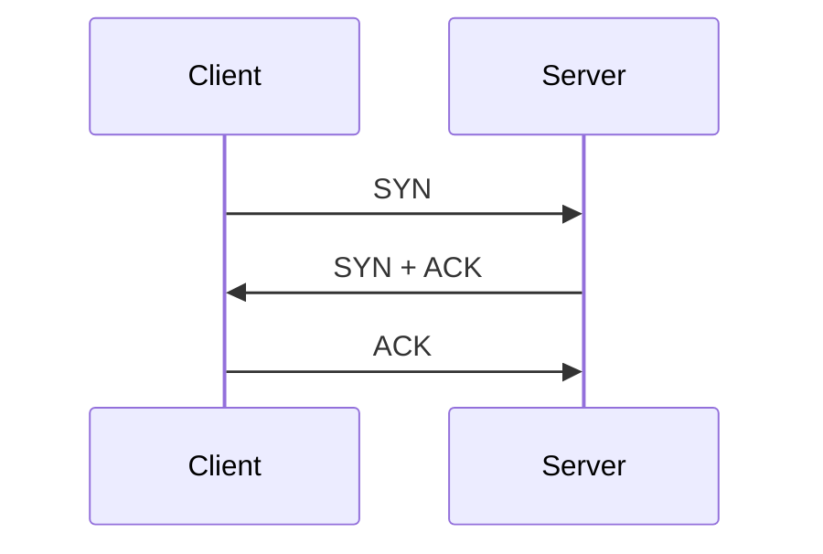

[](https://github.com/kaiosilveira/nodejs-handshaking/actions/workflows/ci.yml)

ℹ️ _This repository is an example implementation in NodeJS of the "handshaking" pattern as described in "Release it! - Nygard" and it is part of my Stability Pattern Series. Check out [kaiosilveira/stability-patterns](https://github.com/kaiosilveira/stability-patterns) for more details._

# Handshaking

In **TCP** (Transmission Control Protocol), to establish a connection, the client and the server should agree on the health of each other. This agreement is performed via a process called _handshake_. This handshake is known as a 3-way handshake and happens as follows:

- the client sends an SYN to the server
- the server answers with a SYN command, alongside an ACK
- the client replies to the ACK command with another ACK

The sequence diagram below shows how it works:



In HTTP, however, there is no such mechanism. We can call a service and it could be unavailable because it is being initialized, under heavy load, or simply because it's dead. That is why when configuring our services, we need to be as transparent as possible regarding its state, especially on initialization time.

In load-balanced applications, we can use the verbosity provided by HTTP to tell the load balancer that a specific instance is not ready yet, without degrading the overall application state (considering that there are multiple running instances, of course). This can be accomplished by configuring the health check endpoint to return `503: Service Temporarily Unavailable` until we are sure that the instance is ready to do some work. This example implements this strategy.

## The health check controller

The HealthCheck controller is a controller responsible for reporting the current health state of the application. It says whether or not the app is ready to perform some work and also some other useful information such as the `HEAD` commit the app is currently running, the runtime version and the environment name. It looks like this:

```typescript
export default class HealthCheckController {
  private readonly appState: ApplicationState;
  private readonly env: ApplicationEnv;

  constructor({ env, applicationState }: HealthCheckControllerProps) {
    this.env = env;
    this.appState = applicationState;

    this.getHealthState = this.getHealthState.bind(this);
  }

  getHealthState(_: Request, res: Response) {
    if (!this.appState.isReady())
      return res.status(503).json({ msg: 'Service temporarily unavailable' });

    return res.json({
      ready: true,
      environment: this.env.NODE_ENV,
      nodeVersion: this.env.NODE_VERSION,
      commitSHA: this.env.COMMIT_SHA,
    });
  }
}
```

As you can see, it relies on two external parameters:

- The application's `env` variable, which contains all the environment variables available for the process in runtime and
- The `ApplicationState` instance. An object that holds the current `ready` state of the app, but that could also hold other information that needs to be globally available

The implementation speaks for itself: It early exists a `503: Service Temporarily Unavailable` if the `applicationState` instance is reporting a "not ready", and returns all the runtime info with a default `200: OK` otherwise.

With this setup, we can simply plug this controller into an Express router to make its method available and then configure the load balancer to ping this endpoint from time to time. More sophisticated implementations would also make use of the fact that `applicationState` can be changed in runtime and allow for admin endpoints to forcefully interrupt service for a given instance (for maintenance purposes, for instance).
